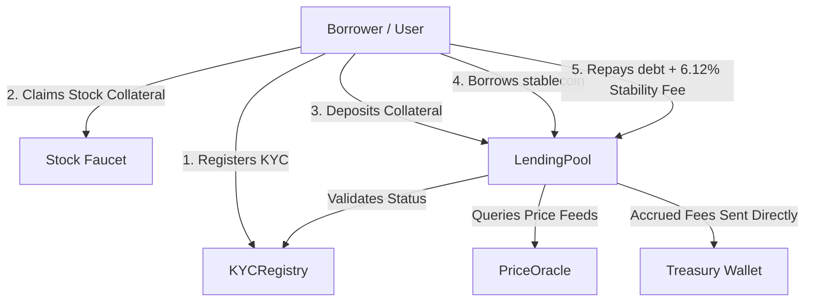

# 🏹 RobinLend

### Compliant, RWA-Backed Lending Protocol on Robinhood Chain L2

RobinLend is an institutional-grade, real-world asset (RWA) backed lending protocol deployed **100% live-on-chain** on the **Robinhood Chain L2 Testnet** (Arbitrum Orbit Orbit L2). 

By leveraging tokenized stock assets as collateral and enclosing operations within a compliance-centric KYC registry, RobinLend allows institutional borrowers and retail liquidity providers to unlock deep capital efficiency securely, with zero gas friction.

---

## 🚀 Key Features

- **Compliant RWA Collateral**: Deposit tokenized equities (TSLA, AMZN, PLTR, NFLX, AMD) to borrow stablecoins.
- **Self-Service KYC Registry**: Real-world operations require compliance. Users can verify their wallets on-chain directly through our decentralized KYC flow to unlock borrowing capabilities.
- **6.12% APY time-based Stability Fee**: Borrow interest accumulates dynamically per second on-chain. When debt is repaid, 100% of the interest fee is routed directly to the **Protocol Treasury Wallet**.
- **Automated 2% Liquidation Protocol Fee**: If a borrower's Health Factor falls below `1.00`, their position is subject to liquidation. The pool routes a 5% discount to the liquidator and captures a 2% protocol fee routed to the **Treasury**.
- **Live Transaction Monitor**: Tracks MetaMask signing requests, transaction broadcasts, confirmations, and provides direct links to the Robinhood Chain Explorer in real time.
- **Maple-style Design System**: Visuals built using a clean 3-color scheme (Midnight Navy `#001830`, Mint Green `#30B888`, and White `#FFFFFF`) tailored to match Robinhood’s brand.

---

## 📍 Deployed Contract Addresses (Robinhood Chain Testnet)

All contracts are live on the **Robinhood Chain L2 Testnet** (Chain ID: `46630`):

| Contract | Address |
| --- | --- |
| **LendingPool** | `0x3144E80709Fc66c8f8850b7b24F470a1b85B960d` |
| **KYCRegistry** | `0x9C186af52067C58Bb98189327Ea4450c9385aFea` |
| **PriceOracle** | `0x563399954F911474e2CEbc0689F0484BEd74D281` |
| **USDCToken** (Mock Stablecoin) | `0xee8327a93b396B1437f48f8D768354bd4beb8520` |
| **Official Stock Faucet** | `0x8762f93772c663c6a88ba50900bd5381df2717be` |
| **Protocol Treasury Wallet** | `0xE84eFc7e3B0b6Ca068e8082BD94DBE16c9056990` |

---

## 🛠️ Architecture



---

## 💻 Running the Project Locally

### Prerequisites
1. **Node.js** (v18+ recommended)
2. **MetaMask Extension** installed in your browser.
3. Custom Network added to MetaMask:
   - **Network Name**: Robinhood Chain Testnet
   - **New RPC URL**: `https://rpc.testnet.chain.robinhood.com`
   - **Chain ID**: `46630`
   - **Currency Symbol**: `ETH`
   - **Block Explorer URL**: `https://explorer.testnet.chain.robinhood.com`

### Steps

1. **Clone the repository**:
   ```bash
   git clone https://github.com/0xnald/RobinLend.git
   cd RobinLend
   ```

2. **Install Dependencies**:
   ```bash
   # Root directory (Hardhat contracts)
   npm install

   # Frontend directory
   cd frontend
   npm install
   ```

3. **Run the React/Vite dev server**:
   ```bash
   npm run dev
   ```
   Open `http://localhost:5173` in your browser.

---

## 🧪 Testing the Smart Contracts

To verify the compliance checks, stability fee calculations, split repayments, and liquidation protocol fees locally:

```bash
# In the root folder
npx hardhat test
```

Expected output:
```bash
  RobinLend Protocol
    Compliance (KYC Registry & RWAToken)
      ✓ Should allow self-service KYC registration
      ✓ Should allow claiming RWA faucet only for KYC verified addresses (102ms)
      ✓ Should restrict minting to KYC verified addresses
      ✓ Should restrict transfers to KYC verified addresses
    LendingPool Operations
      ✓ Should allow depositing RWA collateral
      ✓ Should allow borrowing stablecoin up to LTV (87ms)
      ✓ Should restrict collateral withdrawal if health factor falls below 1
      ✓ Should accrue time-based stability fees and split repayment to treasury
      ✓ Should support liquidation of unhealthy loans with protocol fee cut

  9 passing (5s)
```

---

## 📄 License

This project is licensed under the MIT License.
